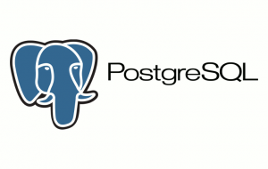

# Udacity Data Engineering Nanodegree

Projects completed in the Udacity Data Engineering Nanodegree [DEND Nanodegree](https://www.udacity.com/course/data-engineer-nanodegree--nd027) program. The underlying theme of the projects is to build data ETL pipelines for an imaginary music streaming startup.

## Project 1: [Data Modeling with PostgreSQL - Relational Databases](https://github.com/ggbong734/udacity-data-engineering/tree/master/relational_db_postgresql)

Developed a PostgreSQL relational database and build an Extract-Transform-Load (ETL) pipeline for a music streaming startup. Tasks include:
* Created fact and dimension tables in PostgreSQL following the star schema 
* Normalization of tables
* Constructed an ETL pipeline to facilitate queries on which songs users listen to

Proficiencies used: Python pandas, PostgreSql, Star schema, Database normalization

## Project 2: [Data Modeling with Apache Cassandra - NoSQL Databases](https://github.com/ggbong734/udacity-data-engineering/tree/master/nosql_db_modeling_cassandra)

Created a NoSQL database using Apache Cassandra to facilitate a few specific queries on users and songs played in music app. Tasks include:
* Developed denormalized tables in Apache Cassandra optimized for a set of queries and business needs

Proficiencies used: NoSQL database, Apache Cassandra, Database denormalization

## Project 3: [Data Warehousing in Amazon Redshift](https://github.com/ggbong734/udacity-data-engineering/tree/master/data_warehousing_redshift)

Created a database warehouse utilizing Amazon Redshift. Tasks include:
* Create AWS Redshift cluster/instance, IAM Roles, Security groups
* Developed a star schema database in Redshift with optimization to analyze songs users played
* Built an ETL Pipeline in Python and SQL that copies data from S3 buckets into staging tables in Redshift

Technologies used: Python, Amazon Redshift, SQL, PostgreSQL

## Project 4: [Data Lake using PySpark](https://github.com/ggbong734/udacity-data-engineering/tree/master/data_lake_etl_pyspark)

Enabled distributed computing in the ETL pipeline in project 3 by utilizing PySpark and moving the data to a data lake. Tasks include:
* Extract, process, and load data in S3 using Spark and load them to a data lake in S3

Technologies used: PySpark, S3

## Project 5: [Data Pipelines with Airflow](https://github.com/ggbong734/udacity-data-engineering/tree/master/data_pipelines_airflow)

Automate the creation of data warehouse, ETL process, and data monitoring tasks using Apache Airflow:
* Using Airflow to automate ETL pipelines using Airflow, Python, Amazon Redshift.
* Writing custom operators to perform tasks such as creating tables, staging data, loading data, and data quality checks.
* Transforming data from various sources into a star schema optimized for the analytics team's use cases.

Technologies used: Apache Airflow, S3, Amazon Redshift.

_README template reference: [Daniel Diamond of Pymetrics](https://github.com/danieldiamond/udacity-dend)_